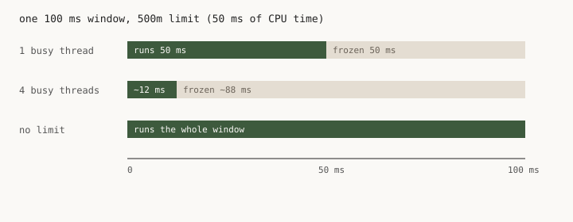
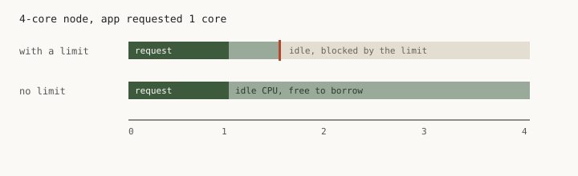

# Kubernetes CPU limits: the mistake, the why, and a small proof

This is a short explanation of what a CPU limit actually does, why
people set one, and why that is usually the wrong protection.

The common mistake is treating `requests.cpu` and `limits.cpu` as
the same knob with a safety margin. They are not. The request is
the share you get when the node is busy. The limit is a freeze the
kernel applies to *your* container, even when the node has idle
cores. That freeze shows up as tail latency, stalled thread pools,
and sometimes as a memory incident. It does not protect the pod
next to you.

The why is below, in plain language, with two diagrams. The proof
is a small simulation: the same app twice on a local minikube
node, one pod with a limit and one without. Tables from that run
are in [results/run.md](results/run.md). Extra notes (.NET,
exceptions) are in [notes.md](notes.md).

## The mistake

Almost every Helm chart I open has both lines. The limit is often
twice the request, or a round number like `1`, or a 100m default
that nobody remembers choosing. The story people tell themselves
is reasonable:

- the request is what the scheduler reserves
- the limit is a ceiling, so a runaway pod cannot eat the node
- together they make performance "predictable"

The first point is right. The other two are not.

A ceiling that stops you from using idle CPU is not predictability.
It is a stall that repeats up to ten times a second. And a pod's
own limit never protects its neighbors. Their requests do.

The rest of this page is that claim, unpacked, then checked on a
cluster you can run yourself.

## Why a limit freezes you

Kubernetes writes the two settings to two different files in the
cgroup.

The **request** becomes `cpu.weight`. When several pods want CPU
at the same time, CFS (the Linux scheduler) splits the node in
proportion to those weights. If your neighbor is idle, you can
use the leftover. When they wake up, they get their share back.
That is the isolation.

The **limit** becomes `cpu.max`: a budget of CPU-*time* per 100 ms
window, shared by every thread in the container. A 500m limit
means 50 ms of CPU time per window, total, not per thread. When
the budget hits zero, the kernel does not run those threads more
slowly. It stops scheduling them until the next window.

One busy thread on a 500m limit runs for 50 ms, then sits for 50
ms. Four busy threads burn the same 50 ms in about 12 ms of wall
time, then sit for the rest of the window. Parallel work is what
makes a "generous" limit bite: a thread pool, a handful of
inbound requests in the same tenth of a second, a GC, consumers
waking together.



This is also why the usual CPU graph does not catch it. Usage is
averaged over a minute. Throttling is a yes/no inside 100 ms. A
pod can spend half its windows frozen and still look like it is
comfortably under the cap. The metric that sees the freeze is
`container_cpu_cfs_throttled_periods_total`.

Idle CPU on the node does not help. The limit is a wall in front
of cores nobody else is using.



Memory is the resource people mash into the same habit. Leave
memory limits on. A leak without a cap can take the node. CPU
is different: too little of it makes the app wait, then it
catches up. There is no CPU equivalent of an OOM kill that
makes a limit worth that wait.

## Why people set them anyway

The fear is a noisy neighbor. Without a limit, something greedy
will steal CPU from everyone else.

That fear names a real problem and then picks the wrong tool.
Under contention, shares already follow requests. A runaway pod
competes with the same weight as everyone else. It cannot take
the CPU another pod's request entitles that pod to. What it
*can* take, if it has no limit, is idle CPU. That is leftover.
Taking leftover does not steal from a neighbor who is actually
working.

So a limit on the greedy pod only stops it from using cores
nobody wanted. A limit on *your* pod freezes you. If the real
gap is that requests are optional, the fix is a default request
(LimitRange), not a CPU limit on whoever looks dangerous.

The other common story is "we need a circuit breaker until we
have quotas." A limit set high enough never to trip does
nothing. A limit low enough to trip only harms the pod it is
attached to. It cannot be both a safety mechanism and harmless.

## Proof: the same app, with and without a limit

I ran this on minikube (Docker driver, 8 CPU). Two pods, same
.NET binary, same 250m request. Both have
`DOTNET_PROCESSOR_COUNT=4` so the runtime is not the variable.
One has a 500m CPU limit. The other does not.

The app has a `/burst` endpoint that wakes several threads and
spins CPU, and a `/mixed` endpoint that does a short spin and
then sleeps, more like a handler that touches a cache. A small
load generator in another pod fires on a wall-clock schedule.

The interesting case is not "offer more CPU than the cap."
Anyone can predict that. The interesting case is a burst whose
average stays *under* the cap, but whose shape burns the quota
inside one window. Four parallel 20 ms spins, five times a
second, adds up to about 400m. Under 500m.

On the open pod those spins finish together, in about one
spin's worth of wall time. On the limited pod they spend the
50 ms budget immediately and wait for the next window. Typical
latency roughly quadrupled. About half the windows showed a
throttle. No errors. A one-minute CPU graph would have looked
fine.

That is the freeze, not a slower loop.

I also sent a short traffic spike at `/mixed`. That one does go
over the cap, so it is the obvious version of the same thing.
The limited pod spent almost every window frozen. The tail got
worse. The middle of the distribution barely moved, because
most of that endpoint is sleep, and sleep does not need CPU.
Without the limit, the spike just used spare cores.

Then a hog: four busy loops on the same node, tiny request, no
CPU limit, hitting the *unlimited* app. Latency did not get
worse. This node still had spare cores, so it is not a packed
production box. What it does show is the direction of the
protection. The victim kept the share its request bought.
Limiting the hog would only have stopped the hog from using
idle CPU. Limiting the victim would have frozen the victim.

Full tables: [results/run.md](results/run.md). One pass.

One setup choice is worth saying out loud. If I had left
`DOTNET_PROCESSOR_COUNT` unset, the limited pod would have
seen one CPU (anything from 100m to 500m rounds up to 1) and
the open pod would have seen eight. Then I would have been
measuring runtime sizing, which is a real pitfall and a
different one. The benches pin the knob so the only YAML
difference is the limit.

## A second pitfall: the runtime reads the quota

.NET (and Go, and Java) look at the limit to size themselves.
Unset, `Environment.ProcessorCount` is `ceil(quota/period)`.
A 100m default, the one in a lot of values files, reports 1.
The ThreadPool minimum and the GC heap count follow that
number. You start with one worker thread, then wonder why a
burst queues.

If you drop limits in a real fleet, pin a default so the same
service does not size itself to a 4-core node in one pool and
a 16-core node in another. See [notes.md](notes.md).

A tight CPU limit can also look like a memory problem. The GC
needs CPU to reclaim. If it is parked for most of every
window, allocation wins and the pod OOM-kills. Check the
throttle ratio before you raise the memory limit.

## Conclusion

Set CPU **requests**. Make them roughly honest. They are how
the scheduler places pods and how the kernel shares a busy
node.

Set memory **limits**. Memory is not compressible.

Do not set CPU **limits** on ordinary first-party services.
They do not protect neighbors. They freeze the app they are
attached to, including on bursts that never reach the cap on
average, and they hide from the graphs people actually watch.

Watch `container_cpu_cfs_throttled_periods_total` and node
CPU. After things have been running without a cap, shrink
requests from real p95 usage. That is the part that can drop
nodes. Deleting the YAML line by itself frees nothing.

Keep a CPU limit in three places: untrusted or third-party
code, a bench that needs a fixed ceiling so runs compare, and
Guaranteed pods on the static CPU manager, where request
equals limit and the "limit" is pinning whole cores.

HPA scales on usage versus request. Dropping the limit does
not change the formula. Usage can climb, so a CPU-based HPA
may add replicas it would not have added under a cap. That is
usually what you wanted.

## Run the simulation

Disposable cluster only. The hog burns CPU on purpose.

```bash
minikube start --driver=docker --cpus=8 --memory=8192
kubectl config use-context minikube   # or set KCTX=minikube

./scripts/run.sh
./scripts/cleanup.sh
```

Needs `kubectl` and `python3` on the laptop. First run pulls
the .NET 10 SDK image and compiles a few times.

`NS` / `KCTX` override namespace and context. Default ns is
`cpu-lab`.
