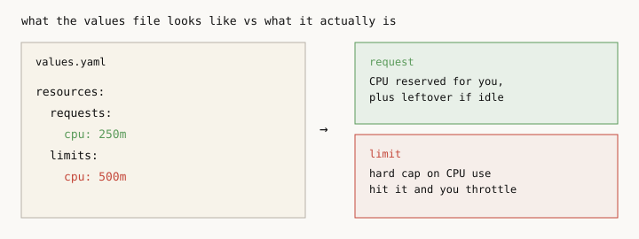
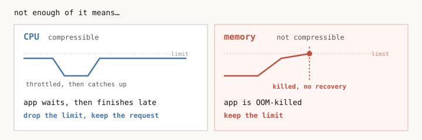
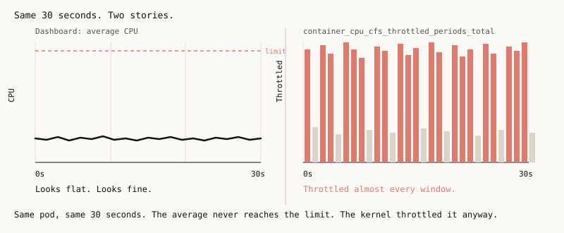
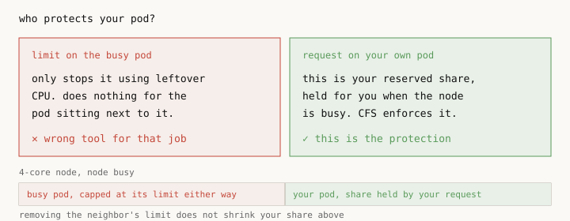
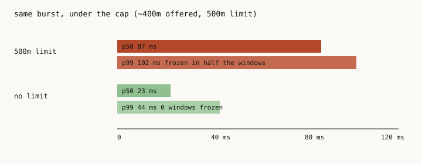
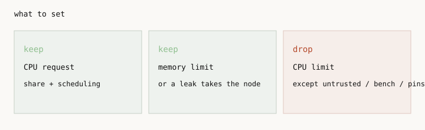

# Kubernetes CPU limits: the mistake, the why, and proof

**TL;DR: set `requests.cpu`, `requests.memory`, and
`limits.memory`, but remove `limits.cpu` (unless you hit one of
the narrow exceptions in the
[conclusion](#conclusion-drop-cpu-limits-keep-requests)).**

This isn't new advice. It's a best practice from Kubernetes
and Google themselves:

> "1) Always set memory limit == request 2) Never set CPU limit"
>
> *Tim Hockin, Kubernetes co-founder, 2019 ([source](https://x.com/thockin/status/1134193838841401345))*

Google's own GKE docs say the same thing: for the CPU request,
"specify the minimum CPU needed... according to your own SLOs,"
then "set an unbounded CPU limit"
([source](https://docs.cloud.google.com/kubernetes-engine/docs/how-to/vertical-pod-autoscaling)).
Most teams still set a CPU limit anyway, then spend their time
fighting the throttling that follows. This analysis explains why
the advice is right, and why so many people still get it wrong.

Most charts set two CPU numbers, a request and a limit, and
people treat them like the same setting with a bit of headroom.
The **request** is how much CPU is reserved for your pod if
it needs it. The **limit** is a hard cap: hit it and the
kernel **throttles** the pod, even when the node still has
spare CPU. This is the most common source of unexpected CPU
throttling on Kubernetes. **A CPU limit does not protect
neighboring pods; their protection comes from their own
requests.** In a controlled burst test below, adding a CPU
limit took typical latency from 23 ms to roughly 87 ms (about
4x slower), with the limited pod throttled in half of all CFS
windows, while the average CPU graph looked fine the whole
time.



Contents: [why requests are enough](#why-cpu-requests-are-enough),
[what average CPU hides](#what-average-cpu-hides),
[the benchmark](#proof-the-same-app-with-and-without-a-cpu-limit),
[.NET and thread pools](#net-looks-at-the-limit),
[CPU limits and OOMKills](#how-cpu-limits-cause-memory-issues-and-oomkills),
[conclusion](#conclusion-drop-cpu-limits-keep-requests),
[common questions](#common-questions-about-kubernetes-cpu-limits),
[run it yourself](#run-the-benchmark-yourself).

## Why CPU requests are enough

Linux already shares a busy node's CPU fairly among pods. That sharing is called CFS
(Completely Fair Scheduler). A request is a weight in the
cgroup, not a pinned core. If the node is busy, CFS splits
time in proportion to those weights: a 16 CPU request gets
about sixteen times the CPU of a 1 CPU request. If the other
pods are idle, a pod can use the leftover; when they need
CPU again, those cores go back. **None of this requires a
CPU limit.**

One caveat: the request guarantees your proportion of CPU
over time, not exactly when you get it. Under heavy
contention your share arrives in slices, so tail latency
can still move a little even with a correct request. A
limit does not fix that, it only adds throttling on top.



A limit is a separate cap, also enforced by CFS. Every 100 ms
the kernel gives your pod a budget of CPU time, and every
thread in the pod shares that budget. When it is gone, the
pod is throttled until the next 100 ms. The node can be idle
and the pod still waits. A 1 CPU limit on a 32-core node can still
run on all 32 cores for a few milliseconds, then sit out the
rest of the window. Four threads working at once burn a 500m
budget in about 12 milliseconds. **It is an average, not a
reserved core.**







## What average CPU hides

The CPU graph on your Kubernetes dashboard usually averages
a minute. CPU throttling lasts a tenth of a second. So **the graph can look fine while
the app is being throttled all the time.** Watch
`container_cpu_cfs_throttled_periods_total`, not average CPU.



People put a limit on because they are afraid some other app
will starve their pod. That is what the request is for. **The
app you care about is protected by its own request.** A
runaway next door can use leftover CPU, but it cannot take
the share you reserved. If leftover on the node is huge, the
requests are too small. If teams can deploy with no request
at all, give them a default request instead of putting a CPU
limit on whoever looks greedy.



The same blindness poisons right-sizing. Usage recorded under
a CPU limit can never go above the limit: the cap clips every
burst, so the history shows what the kernel allowed, not what
the app wanted. Size a request from that history and you copy
the cap's distortion into the request. **Drop the limit first,
let the app run for a while, then measure and set requests
from numbers that were free to move.**

## Proof: the same app with and without a CPU limit

I ran the same .NET app twice on a local 8-CPU minikube. Both
asked for 250m, and I pinned .NET to 4 CPUs on both so I was
not accidentally comparing "app thinks it has 1 core" against
"app thinks it has 8." One pod had a 500m limit. The other
did not.

The useful test is a burst that *on average* stays under 500m,
but for a moment uses several threads at once, which uses up
the limit budget inside one 100 ms window. That is by design:
it is the pattern that produces throttling while the average
CPU graph stays green, which is the exact blind spot this
whole article is about. Typical response time went
up about **4x**, and the limited pod was throttled about half
the time. There were no errors, and a normal CPU graph would
have looked fine.



I also sent a short traffic spike that *did* go over the cap,
and the limited pod was throttled on almost every window. Then
I put another pod on the same machine that just burns CPU in a
loop, with no limit of its own. The app without a limit did
not get slower. That first test still had spare cores on the
node, so [run.sh](scripts/run.sh) also fills the node
completely with that busy neighbor pod, then measures the
unlimited app again with no spare CPU left anywhere on the
node. **The request was enough.**

More numbers and charts: [results/run.md](results/run.md).

## .NET looks at the limit

If you do not set `DOTNET_PROCESSOR_COUNT`, .NET counts CPUs
from the limit. A 500m limit (or the common 100m default)
shows up as 1 CPU, so the thread pool and garbage collector
follow that and you start with one worker thread.

This lab sets `DOTNET_PROCESSOR_COUNT=4` on both pods so the
test is about the limit, not about .NET shrinking itself. In
a real fleet, set one default after you drop limits, or the
same service will behave differently on a 4-core node than on
a 16-core node:

```yaml
- name: DOTNET_PROCESSOR_COUNT
  value: "4"
```

The same idea applies to any runtime that reads the quota: Go
reads it into `GOMAXPROCS`, the JVM has its own equivalent. Pin
these once at the platform level after you drop limits. Do not
keep a CPU limit just to shrink the runtime.

A tight CPU limit can also look like a memory problem. The
garbage collector needs CPU to free memory, and if it is
throttled most of the time, memory grows and the pod gets
killed as an OOM even though nothing leaked. Others have hit
the same wall: [Fairwinds lists throttling as an indirect
cause of OOMKilled](https://www.fairwinds.com/blog/5-ways-you-can-diagnose-and-prevent-oomkilled-errors-in-kubernetes)
("slowing garbage collection or other memory-reclaiming
work"), and [this JVM-on-Kubernetes writeup](https://rasztabiga.me/blog/jvm-in-kubernetes)
shows how a GC burst over the limit turns into throttling and
longer pauses. Check `container_cpu_cfs_throttled_periods_total`
before you raise the memory limit.

This repo reproduces it. See
[the OOMKilled proof](#how-cpu-limits-cause-memory-issues-and-oomkills) below.

## How CPU limits cause memory issues and OOMKills

This can seem backwards: CPU is the compressible resource,
run out and you wait, nothing dies. But memory is
where a CPU deficit accumulates. Wherever work arrives faster
than a throttled pod can process it, the difference sits in
RAM until the kernel ends the pod. The lab reproduces three
common shapes of this, each as an A/B pair: two pods running
the same app, the same memory limit, the same load, with
`limits.cpu` as the only difference in the YAML. Nothing leaks
in any of them; every byte would have been freed if the pod
had been allowed to run the code that frees it. All three
evidence files are in [results/oom.md](results/oom.md).

### Shape 1: the backlog

This is the shape of any in-memory queue: a consumer buffering
messages from Kafka or RabbitMQ faster than it can process
them, an unbounded channel between two components, a server
holding request payloads while handlers run behind.

Work arrives at 20 jobs per second; each job costs 40 ms of
CPU time (measured on the thread CPU clock, so throttling
can't hide it) and holds 2 MiB of memory until a worker
finishes it. That is ~800m of CPU demand against a
`limits.cpu: 500m` cap, with 1Gi of memory on both pods.

The uncapped pod handles the full 800m of work, so its queue
stays empty and memory stays flat. The capped pod is limited
to 500m, so it clears at most 12.5 jobs per second (a bit less
in practice, since receiving and copying payloads draws from
the same budget) while 20 keep arriving. The backlog holds
memory, the backlog only shrinks with CPU the pod isn't
allowed to use, and the kernel eventually OOMKills it.


In the recorded run (`scripts/oom.sh`), the capped pod drained
10.3 jobs per second against 20 arriving and was OOMKilled
after 29 seconds of load (exit code 137,
`lastState.terminated.reason: OOMKilled`), throttled in 96% of
CFS periods during that window. The uncapped pod drained 21.6
jobs per second with an empty queue, flat memory, and zero
restarts. Numbers vary slightly run to run (see the note on
SDK-image page cache in [results/oom.md](results/oom.md)); the
outcome doesn't.

A bounded worker pool doesn't prevent this: it bounds CPU
concurrency, not memory. The common shape is a bounded pool
fed by an unbounded handoff queue, and the lab's own worker
pool is size one. Unbounded buffers are also more common than
they look: RabbitMQ's prefetch is unlimited unless `basic.qos`
is set, and Kafka consumers that hand records to an in-process
queue to keep polling within `max.poll.interval.ms` and avoid
a rebalance have effectively rebuilt the unbounded buffer one
layer down. Even a properly bounded buffer is usually sized
for the healthy drain rate, which the cap just cut in half.
And a consumer with real backpressure everywhere does not
remove the deficit, it relocates it: lag piles up in the
broker instead of in RAM. The CPU limit decides which
resource absorbs the shortfall; only removing the limit
removes the shortfall itself.

### Shape 2: GC starvation

This is a completely different scenario, one that involves the
garbage collector instead of a queue or buffer. Every request
builds a reference-dense graph of 10,000 small objects (~1.5
MiB) and holds it only while doing real work; once the request
finishes, the graph is garbage. Nothing is retained anywhere,
on purpose. What runs short here is the garbage collector's
own CPU budget: on the capped pod (`limits.cpu: 100m`, the
same value as the production incident this test is based on),
in-flight requests pile up, the live object count grows with
them, each GC cycle gets more expensive, and the collector
fights the workload for the same shrinking quota.


In the recorded runs (`scripts/gc.sh`, three of three, on .NET
10 with adaptive DATAS GC enabled), the capped pod stopped
answering its own stats endpoint, kept digesting its backlog
after the load generator had already stopped, and was
OOMKilled anyway (exit 137). The identical uncapped pod
finished the same load with a 9.3 MiB heap and one request in
flight. This is also the shape where monitoring goes dark
first: a pod too throttled to answer a stats scrape is a pod
whose dashboards and probes are already lying.

### Shape 3: Web API

This is an example of how an API server is prone to memory
issues because of CPU limits. There is no queue anywhere in it.

Every request allocates its working set (a decoded image, a
deserialized result set, a report being assembled), awaits a
downstream call, does its CPU work on it, and frees the buffer
before returning. Nothing is retained: no request's memory
outlives the request, and both pods run byte-identical handler
code with an identical per-request footprint.

What differs is only how many requests exist at once, which is
Little's Law: in flight = arrival rate x service time. A CPU
limit cannot touch the arrival rate (that belongs to the
client) or the footprint (that belongs to the code), so it
stretches service time, and the in-flight count rises to match.
Memory is in-flight count x footprint. Nothing in ASP.NET Core
bounds it by default: Kestrel's `MaxConcurrentConnections` is
`null`, and there is no request-concurrency cap unless the app
adds rate limiting itself.

In the recorded run (`scripts/web.sh`, 100m cap, 512Mi memory,
20 rps of requests costing 40ms of CPU and holding 8 MiB), the
capped pod's anonymous memory climbed from 258 MiB to 366 MiB
and it was OOMKilled after 20 seconds of load (exit code 137,
`lastState.terminated.reason: OOMKilled`), throttled in 100% of
CFS periods. The identical uncapped pod held 5 requests in
flight and 40 MiB for the entire run and never restarted.
Seconds-to-death moves by a few either way between runs; which
pod dies does not.

Two implementation details decide whether this reproduces:

The handler has to allocate *before* its first `await`.
Allocate after it and the backlog lands in the ThreadPool queue
at a few hundred bytes per entry, the in-flight count tracks
ThreadPool thread injection (roughly one thread per second)
instead of the arrival deficit, and memory plateaus at threads
x footprint. That is what the first run measured: in-flight
pinned to thread count, 76 MiB held, no death. That is a real
result - it is what an app that streams rather than buffers
gets - but it is a different shape.

And the cap is not what sets time-to-death; the per-request
footprint is. This system self-throttles: as the ThreadPool
queue grows, Kestrel's accept loop is competing for the same
shrinking quota, so the rate at which new requests reach a
handler collapses alongside the drain rate. Tightening
`limits.cpu` slows accumulation about as much as it slows
draining. Going from 500m to 100m barely moved the runway;
going from 2 MiB to 8 MiB per request took it from minutes to
under half a minute.

The capped pod also stops serving its own observability, more
completely than in shape 2: it never answered `/webstats` once
during the load, so every number above was read from the cgroup
by a separately exec'd process. A pod too throttled to serve its
own stats endpoint cannot serve a metrics scrape or a probe
either.

All three shapes end the same way on a graph: memory climbing
into the limit. It looks like a leak, the usual fix is a
bigger memory limit, and the actual cause is the CPU limit.
Check `container_cpu_cfs_throttled_periods_total` before you
raise `limits.memory`.

## Conclusion: drop CPU limits, keep requests



- keep `requests.cpu`: it reserves your share
- keep `limits.memory`: or a leak takes the node
- drop `limits.cpu`: set it only if you really know what you are doing

After you drop CPU limits, look at that throttling metric and
at node CPU. Dropping `limits.cpu` does not shrink the cluster
by itself — it only removes the distortion that was blocking
honest right-sizing of `requests.cpu`. **The savings come from
the request right-sizing that follows, not from deleting the
limit line.**

**Leave `limits.memory`.** If CPU is short, the app waits. If
memory is short, the app (or the node) dies.

There are a few narrow exceptions:

| Use a CPU limit for: | Don't use a CPU limit for: |
|---|---|
| <ul><li>A benchmark that needs a hard, repeatable ceiling</li><li>A pod that pins whole cores on purpose</li><li>A multi-tenant platform (e.g. a cloud provider)</li></ul> | <ul><li>A web service like a frontend UI, BFF, or API</li><li>A background worker or cron job</li><li>Databases and tooling (Redis, Kafka, RabbitMQ, etc.)</li><li>Anything else not in the list on the left</li></ul> |

If you run one of the cases on the left, you already know
it. **Everything else: don't set a CPU limit.**

Autoscaling on CPU compares use to the *request*, not the
limit. Removing the limit does not change that formula. Use
can go higher, so you may get more replicas, which is
usually fine.

Dropping `limits.cpu` moves a pod from Guaranteed to Burstable
QoS. In practice this rarely matters: the kubelet evicts for
memory pressure, not CPU, and it ranks pods by how far usage
exceeds the request, not by QoS class alone. Keep
`requests.memory` equal to `limits.memory` and eviction
exposure barely moves. Full answer, with the eviction docs
link, in the
[FAQ](#common-questions-about-kubernetes-cpu-limits).

Before you drop a limit: pin the runtime's own CPU-count knob
(`DOTNET_PROCESSOR_COUNT`, `GOMAXPROCS`, the JVM's
`-XX:ActiveProcessorCount`) so it does not size itself off a
number that is about to disappear, and check the kubelet has
`--system-reserved` / `--kube-reserved` set so its own
daemons keep their share. [Rollout](docs/06-rollout.md) has
the full staged plan: pin runtimes first, add observability,
add guardrails, then drop limits namespace by namespace.

## Common questions about Kubernetes CPU limits

**Should I set CPU limits in Kubernetes?**
For most services, no. Keep `requests.cpu` so CFS reserves
your share, keep `limits.memory`, and drop `limits.cpu`. The
exceptions (benchmarks, pinned cores, per-customer billing)
are listed in the [conclusion](#conclusion-drop-cpu-limits-keep-requests).

**How do I fix CPU throttling in Kubernetes?**
Raise or remove `limits.cpu` on the throttled pod; nothing
else stops it. Confirm with
`container_cpu_cfs_throttled_periods_total` first, then check
that the pod's request roughly matches its real baseline use.

**Isn't your 4x latency just a request that was too low?**
Partly, and that is the point. Burst above the request is
opportunistic, never guaranteed: the implicit ceiling is
node capacity and your neighbors. Size the request for
baseline performance, not for the minimum that boots the
app, and treat burst as a bonus. But even with a perfect
request, a limit only subtracts. Without a limit the worst
case is your weighted share and the best case is more. With
a limit the best case is the cap, even on an idle node. And
"I am under my limit on the graph" does not mean no
throttling: four threads for 20 ms burn a 500m window
budget while the one-minute average stays comfortably
under 500m. That is exactly what the burst test shows.

**How is a request enforced?** It is a CFS weight
(`cpu.shares` / `cpu.weight`). The Kubernetes scheduler will
not pack more requested CPU onto a node than the node has.
When the node is actually busy, CFS splits time in those
weights. A 16 CPU request next to sixteen 1 CPU requests
gets about half the machine. Nothing else is required.

**Doesn't a limit stop a bad pod from eating the node?**
Monopolizing a node is a myth. Spare CPU is borrowed, not
taken: the moment another pod wants CPU, CFS pulls those
cores back within milliseconds and splits time by request
weights again. A limit on the busy pod only stops it using
CPU that would otherwise sit idle. It does not give CPU to
anyone else: the neighbor is protected by its request. If
several pods burst at once, the leftover is not first come
first served, CFS divides it in proportion to their
requests. If leftover on the node is huge, the requests on
that node are too small.

**Don't Go / Java / .NET need the limit to size the thread
pool?** They often read the quota and treat it as the CPU
count. Drop the limit and they may size themselves to the
whole node. Set `GOMAXPROCS`, the JVM equivalent, or
`DOTNET_PROCESSOR_COUNT`. Do not keep a CPU limit just to
shrink the runtime.

**Does HPA look at the limit?** No. CPU autoscaling is use
divided by the request. After you drop the limit, use can
run past 100% of the request and you may get more replicas.

**Don't I want a limit so the app behaves the same on a
quiet node and a busy one?** That is what a limit buys:
the same cap everywhere, including when the node is idle.
You pay for that with throttling. Most services should use idle CPU when it's there; consistency is the exception, not the default.

**Is this a reserved core?** Only if the node pins whole
cores (`cpuManagerPolicy: static`, integer request, request
equal to limit). Setting request equal to limit by itself
does not pin. Pinning is a separate setup some large
companies use to give a pod exclusive physical cores. Leave
that alone unless you already use it.

**Doesn't dropping the limit lose Guaranteed QoS?** Yes, the pod becomes Burstable. In practice this matters
less than it sounds: the kubelet evicts pods under memory
pressure, never for CPU. CPU is compressible, when it is
short you wait, nothing gets killed. Keep memory request
equal to memory limit and your eviction exposure is
basically unchanged. Note also that under node pressure the
kubelet ranks pods by how far usage exceeds the request,
not purely by QoS class ([docs](https://kubernetes.io/docs/concepts/scheduling-eviction/node-pressure-eviction/#pod-selection-for-kubelet-eviction)).
If a platform enforces request equal to limit (like GKE Autopilot does), this article's advice to drop the limit does not apply there.

**My JVM/Spring Boot pods idle at 20m but need 800m to
start. Without limits, 30 restarting pods fight each other.**
That is a race for CPU either way, and limits make it
worse: every pod gets throttled and the idle CPU goes
unused. Fix the actual problem: stagger the rollout
(maxSurge/maxUnavailable), set a request above the
embarrassing 20m, or give pods a temporary boost during
boot with kube-startup-cpu-boost,
built on in-place pod resize (beta since Kubernetes 1.33,
GA in 1.35). Watch readiness probes too: slow starts under
contention can flap probes and mislead the HPA.

**After I drop limits, can a burster hurt the node itself?**
Not the other pods, but kubelet, containerd, the CNI, and
log shippers often run with tiny or no CPU reservation. A
pod bursting into all spare CPU can delay exec probes and
flap readiness. The fix is system-reserved and
kube-reserved in the kubelet config, which carves out CPU
for the node's own daemons. A per-pod CPU limit is the
wrong tool for this.

**I dropped the limit and the pod was rejected.**
A namespace ResourceQuota on limits.cpu forces every
pod to declare a limit, and a LimitRange default silently
injects one. Check both before rolling this out. Quota on
requests.cpu instead: that is the number the scheduler
actually books.

## Run the benchmark yourself

Use a throwaway cluster. One of the pods will burn CPU on
purpose.

```bash
minikube start --driver=docker --cpus=8 --memory=8192
kubectl config use-context minikube

./scripts/run.sh
./scripts/oom.sh
./scripts/gc.sh
./scripts/web.sh
./scripts/cleanup.sh
```

`run.sh` is the latency/throttling lab. `oom.sh`, `gc.sh` and
`web.sh` are the three OOMKilled proofs (the backlog, the
starved collector, and the in-flight request set); each ends as
soon as the capped pod dies, `web.sh` in well under a minute of
load. Run `cleanup.sh` between them: `gc.sh` insists on fresh
pods.

Needs `kubectl` and `python3`. First run downloads the .NET
SDK image, which is multi-GB, so give it a minute. After that
the whole thing takes roughly 5-10 minutes. `NS` and `KCTX`
change the namespace and cluster if you need to. The run
ends by filling the node completely with a busy neighbor pod,
then measuring the unlimited app again, and it regenerates
the results charts from the fresh numbers.

Expect output like this as it runs:

```
[14:02:11] target context=minikube ns=cpu-lab
[14:03:47] waiting for app-limit
[14:09:02] === burst  ~400m average, 5 rps, 45s ===
[14:09:52] load job=burst-limit rps=5 45s -> http://app-limit/burst?threads=4&ms=20
```

## Repo layout

- `app/` - the .NET test app (burst, mixed, enqueue, gcwork, render, and info endpoints)
- `k8s/` - manifests for the pods, the load job, the busy neighbor pod, and the stats probe
- `scripts/` - `run.sh` drives the latency lab, `oom.sh`, `gc.sh` and `web.sh` the OOMKilled proofs, `lib.sh` holds shared helpers
- `results/` - output of the last run, including `run.md`, `oom.md`, and raw JSONL
- `assets/` - diagrams and charts used in this README
- `docs/` - deep-dive reference chapters (theory, runtimes, databases, measuring, cost, rollout, objections)

## Deep dives

The README is the argument; `docs/` is the reference material behind it:

- [Theory: CFS quota mechanics](docs/01-theory.md) - quota/period, multi-thread quota burn, why throttling is a stall not a slowdown, what `cpu.weight` actually protects.
- [Runtimes](docs/02-runtimes.md) - what a CPU limit does to .NET's ThreadPool and GC, Go's `GOMAXPROCS`, the JVM's `ActiveProcessorCount`, and an OOMKilled incident caused by GC starvation.
- [Databases](docs/03-databases.md) - why Postgres sizes itself from node cores regardless of quota, and what that does to parallel workers, autovacuum, and connection counts.
- [Measuring](docs/04-measuring.md) - PromQL for throttle ratios, severity bands, and what "after" should look like in your own cluster.
- [Cost](docs/05-cost.md) - why requests (not limits or usage) drive node count, a worked right-sizing model, and the memory floor on savings.
- [Rollout](docs/06-rollout.md) - a staged, reversible plan: pin runtimes, add observability, add guardrails, drop limits env by env, right-size requests, one-line rollback.
- [Objections](docs/07-objections.md) - the deeper FAQ: noisy neighbors, the "limit as circuit breaker" dilemma, multi-tenant quotas, QoS/eviction nuance, and when limits do make sense.

## Further reading

- Tim Hockin (Kubernetes co-founder): ["do not use CPU limits"](https://x.com/thockin/status/1134193838841401345)
- Natan Yellin, [Stop using CPU limits on Kubernetes](https://home.robusta.dev/blog/stop-using-cpu-limits) - the same conclusion as a 2x2 decision table.
- Datadog, ["When to set CPU limits"](https://www.datadoghq.com/blog/kubernetes-cpu-requests-limits/)
- [Kubernetes docs: resource requests and limits](https://kubernetes.io/docs/concepts/configuration/manage-resources-containers/) - how requests, limits, and CFS quota fit together.
- Dave Chiluk, ["Throttling: New Developments in Application Performance with CPU Limits"](https://www.youtube.com/watch?v=UE7QX98-kO0) (KubeCon NA 2019) - the CFS throttling bug and why limits hurt more than the naive model suggests.
- Numerator Engineering, ["Requests are all you need"](https://www.numeratorengineering.com/requests-are-all-you-need-cpu-limits-and-throttling-in-kubernetes/) - a production case study: an NGINX pod on a 96-core node dropped to 37% throughput under a 100m CPU limit.
- The kernel's CFS bandwidth burst feature (`cpu.max.burst`) lets a cgroup borrow a little unused budget from past periods, softening some of this without removing the limit.

---

*This analysis was co-produced with Claude Fable 5 and Grok 4.6.*
