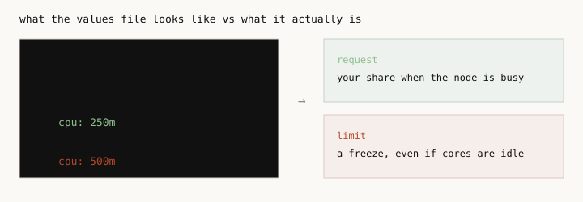
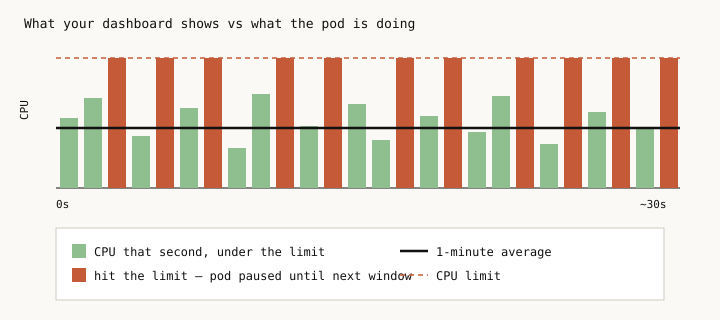

# Kubernetes CPU limits: the mistake, the why, and proof

Most charts set two CPU numbers: a request and a limit. People treat
them like the same setting with a bit of headroom. They are not.

The request is "save me this much when the machine is busy."
The limit is "never let me use more than this, even if the machine
is sitting there idle." That second one does not protect the app
next to you. It just means: pod paused until next window. Over
and over, ten times a second.



## Why

That sharing is already built into Linux. It is called CFS
(Completely Fair Scheduler). It runs on every node. Kubernetes
turns your CPU request into a weight. When the machine is full,
CFS splits time by those weights. If another app is idle, you
can use the leftover. When it wakes up, it gets its share back.
You do not need a CPU limit for any of that.

The pictures below move. If they sit still, click them.


A limit is a separate budget, also enforced by CFS. Every
tenth of a second the kernel gives your pod a slice of CPU
time. All of its threads share that slice. When it is used
up, the pod is not slowed down. The pod is paused until the
next window. Four threads working at once burn a 500m budget
in about 12 milliseconds. Then: pod paused until next window.


Your CPU graph usually averages a minute. The pauses last a
tenth of a second. So the graph can look fine while the app is
being stopped all the time. The number that actually shows this
is `container_cpu_cfs_throttled_periods_total`.




People put a limit on because they are afraid some other app will
eat the node. That is the wrong fix. The app you care about is
protected by *its own* request. If teams can deploy with no
request at all, give them a default request. Do not put a CPU
limit on whoever looks greedy.


## Proof

I ran the same .NET app twice on a local 8-CPU minikube. Both
asked for 250m. I also pinned .NET to 4 CPUs on both, so I was
not accidentally comparing "app thinks it has 1 core" vs "app
thinks it has 8." One pod had a 500m limit. The other did not.

The useful test is a burst that *on average* stays under 500m,
but for a moment uses several threads at once. That used up the
budget inside one slice. Typical response time went up about
4x. About half the time: pod paused until next window.
No errors. A normal CPU graph would have looked fine.


I also sent a short traffic spike that *did* go over the cap.
Almost every slice: pod paused until next window. Then I put
another pod on the same machine that just burns CPU in a loop
(no limit of its own). The app without a limit did not get
slower. This machine still had spare cores, so it was not a
packed production node. It only shows the direction: the
request was enough.

More numbers and charts: [results/run.md](results/run.md).
A bit more on .NET: [notes.md](notes.md).

## Conclusion


After you drop CPU limits, look at that pause metric and at
node CPU. Later you can shrink requests to what the apps
really use. That is what can save machines. Deleting the
limit line by itself does not.

I would still set a CPU limit on code you do not trust, on a
benchmark that needs a hard ceiling, and on pods that pin
whole cores (request and limit set equal on purpose).

## Run it

Use a throwaway cluster. One of the pods will burn CPU on
purpose.

```bash
minikube start --driver=docker --cpus=8 --memory=8192
kubectl config use-context minikube

./scripts/run.sh
./scripts/cleanup.sh
```

Needs `kubectl` and `python3`. First run downloads a large
.NET image. `NS` and `KCTX` change the namespace and cluster
if you need to.
