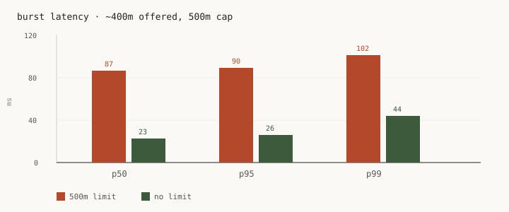
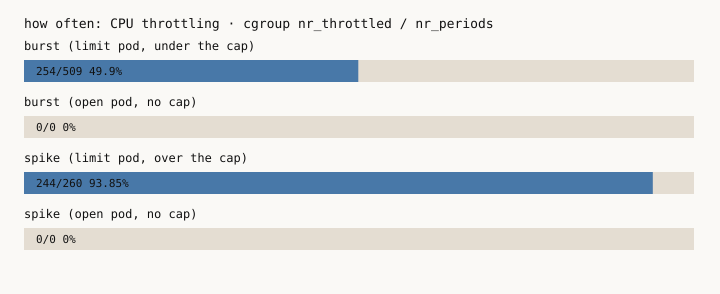
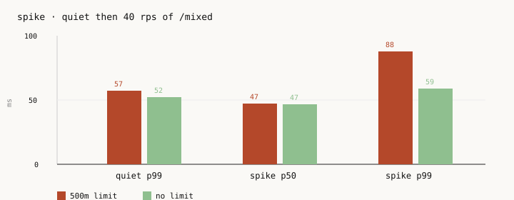
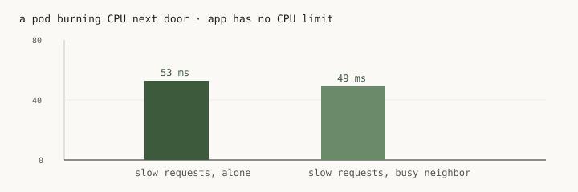

# numbers from this run

2026-08-16 13:21 WEST. minikube, 8 CPU, ns `cpu-lab`.
Both pods: 250m request, `DOTNET_PROCESSOR_COUNT=4`. One has `limits.cpu: 500m`.
Startup is 3 restarts (ignore it). Everything else is one pass.

## burst

`/burst?threads=4&ms=20` at 5 rps, 45s. Offered ~400m, under the 500m cap.





| | p50 | p95 | p99 | throttle | errors / timeouts |
|---|---|---|---|---|---|
| 500m limit | 86.9 | 89.5 | 101.6 | 49.90% (254 / 509) | 0 / 0 |
| no limit | 22.7 | 26.1 | 43.7 | 0.00% | 0 / 0 |

## spike

`/mixed?cpuMs=15&ioMs=30`. Quiet 5 rps (20s), then 40 rps (20s). Over the cap. p50 barely moves because of the 30ms sleep.



| | quiet p99 | spike p50 | spike p99 | spike throttle |
|---|---|---|---|---|
| 500m limit | 57.4 | 47.0 | 87.8 | 93.85% (244 / 260) |
| no limit | 52.0 | 46.6 | 58.8 | 0.00% |

## hog

Victim is app-open (no CPU limit). Hog is 4 busy loops, 100m request, no CPU limit. 8-core node. Didn't pack it.



| | p99 | throttle |
|---|---|---|
| no hog | 52.9 | 0.00% |
| hog on the node | 49.2 | 0.00% |

```
app-limit-64bdf458f-gmkc2   minikube
app-open-74cfd9d5b5-qbs9m   minikube
hog-5b894989-vks8q          minikube
```

## what .NET saw

| pod | ProcessorCount | cpu.max |
|---|---|---|
| app-limit (500m cap) | 4 | `50000 100000` |
| app-open (no cap) | 4 | `max 100000` |

## startup

`dotnet run` compiles on every start. Times overlapped.

| | runs (s) | median |
|---|---|---|
| 500m limit | 35, 36, 40 | 36 |
| no limit | 32, 28, 47 | 32 |

Raw: [`run.jsonl`](run.jsonl).
